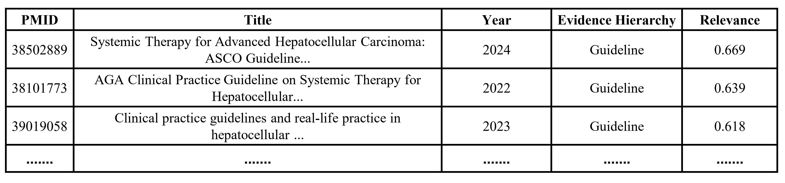

# EBMChat

Implementation of the Paper "[Augmenting Large Language Models and Retrieval-Augmented Generation with an Evidence-Based Medicine-Enabled Agent System](https://www.medrxiv.org/content/10.1101/2025.10.17.25338266v1)" (upload MedRxiv) by Yi Yu et al.. EBMChat is a novel LLM-based agent that integrates Evidence-Based Medicine principles and contextual conversation capabilities in answering clinical questions. 


## Install via Anaconda
Create a new environment:
```bash
cd ebmchat
conda env create -f environment.yml
conda activate ebmchat
```
Install the ebmchat package
```bash
python setup.py install
```

## Getting start
First set up your API keys in your environment.
```
export OPENAI_API_KEY=your-openai-api-key
```

In a Python:
```python
from ebmchat.app import EBMChat
'''initial question'''
EBMChat("What are treatments for advanced hepatocellular carcinoma", "thread_003")
```
1st output is:
```bash
Initial Answer:
1. First-Line Systemic Therapy - The mainstay for advanced hepatocellular carcinoma (HCC) includes multikinase inhibitors such as sorafenib and lenvatinib, both shown to improve overall survival in unresectable cases (Section: Systemic Therapy for Advanced HCC).
   1.1. Sorafenib - Standard first-line agent; benefits include modest survival improvement and manageable toxicity.
   1.2. Lenvatinib - Non-inferior to sorafenib; offers higher response rates but similar survival outcomes.

2. Immunotherapy - Immune checkpoint inhibitors, particularly atezolizumab combined with bevacizumab, have demonstrated superior survival and response rates compared to sorafenib (Section: Immunotherapy in HCC).
   2.1. Atezolizumab + Bevacizumab - Preferred first-line option for eligible patients due to improved efficacy.
   2.2. Nivolumab and Pembrolizumab - Used as second-line agents after sorafenib failure; response rates are modest.

3. Second-Line Targeted Therapy - For patients progressing on first-line therapy, options include regorafenib, cabozantinib, and ramucirumab (Section: Second-Line Systemic Therapy).
   3.1. Regorafenib - Approved for patients who tolerated sorafenib; improves survival.
   3.2. Cabozantinib - Effective for patients previously treated with sorafenib.
   3.3. Ramucirumab - Specifically for patients with elevated AFP (≥400 ng/mL).

4. Patient Selection and Disease Factors - Treatment choice depends on liver function (Child-Pugh score), performance status, and comorbidities; not all patients are eligible for immunotherapy or targeted agents (Section: Patient Selection and Treatment Considerations).

Summary: Advanced HCC treatment includes first-line multikinase inhibitors (sorafenib, lenvatinib), immunotherapy (atezolizumab + bevacizumab), and second-line agents (regorafenib, cabozantinib, ramucirumab), with therapy tailored to liver function and patient status.

Citation: Systemic Therapy for Advanced Hepatocellular Carcinoma: ASCO Guideline Update. Guideline, J Clin Oncol, 2024, https://doi.org/10.1200/JCO.23.02745, 38502889.
```

```python
from ebmchat.app import EBMChat
'''2nd question'''
EBMChat("please show me the Guideline information from the generated table file", "thread_003")
```
2nd output is:

