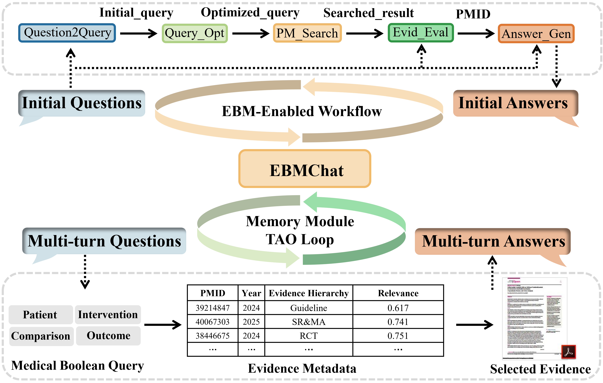

# EBMChat

Implementation of the Paper "[Augmenting Large Language Models and Retrieval-Augmented Generation with an Evidence-Based Medicine-Enabled Agent System](https://www.medrxiv.org/content/10.1101/2025.10.17.25338266v1)" (upload MedRxiv) by Yi Yu et al.. EBMChat is a novel LLM-based agent that integrates Evidence-Based Medicine principles and contextual conversation capabilities in answering clinical questions. 



## Install via Anaconda
Create a new environment:
```bash
cd ebmchat
conda env create -f environment.yml
conda activate ebmchat
```
Install the ebmchat package
```bash
python setup.py install
```

## Getting start
First set up your API keys in your environment.
```
export OPENAI_API_KEY=your-openai-api-key
```

In a Python:
```python
from chatmoldata.agents import ChatMolData

CMD = ChatMolData(model="gpt-4", temp=0.1)
CMD.run('''For ./data/mol_smiles.csv, calculate the multiple proper-tiesofthe molecules and the plot histogram showing distribution ofdifferent properties, properties inelude MW, ALogP, tPSA and QED.''') 
```
The output is:
```bash
Final Answer: The multiple properties of the molecules in the provided CSV file have been calculated and histograms showing the distributions of these properties have been plotted. The final CSV file with the calculated properties is 'mol smiles cleanedpred.csv`
```

